# 🏥 Nayan Eye Care — Complete System Flow Diagram
> **Both Customer & Supplier sides — Full lifecycle in one diagram**

---

## 🗺️ Legend

```
[Page/Screen]       → User-facing UI
{Service/API}       → Backend logic or service call
(DB Table)          → Database table
⚠️ WARNING          → Gap / incomplete feature
✅                  → Fully implemented
❌                  → Missing / not implemented
```

---

## 🔐 LAYER 0 — Authentication Gateway

```
┌─────────────────────────────────────────────────────────────────────────┐
│                        WEBSITE ENTRY POINT  (/)                         │
│                                                                         │
│   Visitor arrives → authService.isAuthenticated() checks sessionStorage │
│                                                                         │
│         ┌──────────────────┬──────────────────────────┐                 │
│         │                  │                          │                 │
│    NOT LOGGED IN      LOGGED IN (Supplier)       LOGGED IN (Customer)   │
│         │                  │                          │                 │
│   [Home Page]    [/supplier/dashboard]          ⚠️ NOT IMPLEMENTED       │
│   (Customer-     (Supplier Panel)               Customer portal         │
│    facing site)                                 login does not exist    │
└─────────────────────────────────────────────────────────────────────────┘
```

---

## 👤 LAYER 1 — CUSTOMER SIDE (Public Facing)

```
┌─────────────────────────────────────────────────────────────────────────────────────────────────┐
│                               CUSTOMER JOURNEY (Public Website)                                 │
│                                                                                                 │
│  [Home Page /]                                                                                  │
│       │                                                                                         │
│       ├──→ [/spectacles]     Browse Spectacles catalog                                          │
│       ├──→ [/sunglasses]     Browse Sunglasses catalog                                          │
│       ├──→ [/contact-lenses] Browse Contact Lenses catalog                                      │
│       ├──→ [/frames]         Browse Frames catalog                                              │
│       └──→ [/solutions]      Browse Solutions catalog                                           │
│                                                                                                 │
│       ⚠️ ALL ABOVE PAGES ARE STATIC — No real inventory data shown from DB                      │
│       ❌ No Add to Cart                                                                         │
│       ❌ No Customer Login / Registration portal                                                │
│       ❌ No Online Order / Booking system                                                       │
│       ❌ No Prescription upload / Eye test booking                                              │
│       ❌ No Customer account to view past orders                                                │
│       ❌ No Customer payment gateway                                                            │
│                                                                                                 │
│  HOW CUSTOMER ACTUALLY BUYS (Current real flow):                                               │
│       Customer visits physical store                                                            │
│            ↓                                                                                    │
│       Staff (Supplier) creates billing on their behalf                                          │
│            ↓                                                                                    │
│       Customer exists only in backend (customers table)                                         │
└─────────────────────────────────────────────────────────────────────────────────────────────────┘
```

---

## 🏪 LAYER 2 — SUPPLIER SIDE (Management Panel)

### 2A. Supplier Login

```
[Header → Login Button]
        ↓
[Login Modal / Form]
  email + password submitted
        ↓
{authService.login()}
        ↓
  → POST /api/auth/login
        ↓
  ┌─────────────────┐
  │  Auth Response  │
  ├─────────────────┤
  │ SUCCESS         │ → JWT token stored in sessionStorage
  │                 │ → window.dispatchEvent('authChange')
  │                 │ → Redirect to /supplier/dashboard
  ├─────────────────┤
  │ FAILURE         │ → Show error (currently mock only)
  └─────────────────┘
        ↓
⚠️ Currently: hardcoded mock — siddhesh@amityonline.com / Sameer123
❌ No real multi-user auth from DB
❌ Session lost on tab close (sessionStorage, not localStorage)
```

---

### 2B. Supplier Dashboard

```
[/supplier/dashboard]
        ↓
{dashboardService.getDashboardData(timeFilter, year)}
        ↓
  Reads from JSON files (NOT live API):
  ├── purchase-records.json  → Total Purchases
  ├── billing-records.json   → Total Sales
  ├── customer-records.json  → Active Customers
  └── inventory-records.json → Stock Value

  Calculations:
  ┌──────────────────────────────────────────────────────────────┐
  │  Net Profit    = Total Sales Revenue − COGS                  │
  │  COGS          = Σ (unitCost × qtySold) + GST on cost        │
  │  Profit Margin = (Net Profit / Total Sales) × 100%           │
  │  Monthly Growth= (This Month − Last Month) / Last Month × %  │
  └──────────────────────────────────────────────────────────────┘

  Cards shown:
  ├── Total Revenue
  ├── Net Profit
  ├── Active Customers
  ├── Monthly Growth %
  ├── Category Breakdown (by item count, NOT revenue)
  ├── Branch Performance (DIGL / MAYA / RANG / JUNG)
  └── Monthly Trend Chart (12 months)

⚠️ Dashboard reads JSON files, not live DB → stale data possible
❌ Returns (sales/purchase) not factored into P&L
❌ Low stock alerts not shown on dashboard
```

---

### 2C. Purchase Flow (Supplier Buys from Supplier/Vendor)

```
══════════════════════════════════════════════════════════════════
                    PURCHASE ENTRY FLOW
══════════════════════════════════════════════════════════════════

PATH A: Single Purchase (/supplier/purchase)
─────────────────────────────────────────────
[Purchase Form]
  Fields: purchaseBillNo, purchaseDate, branch
          materialName, productCode, productDescription
          category, subcategory, hsn
          quantity, purchasePrice, inputGSTPercent
          supplierName, supplierAddress, supplierGstin
          remarks
        ↓
{purchaseService.appendPurchaseData()}
        ↓
  → POST /api/purchases
        ↓
  [Java: PurchaseService.java]
  → Save to (purchases) table
  → updateInventoryFromPurchase():
       findByProductCode(productCode)
       ┌── EXISTS → quantity += purchasedQty
       │            (update purchaseDate if newer)
       └── NOT EXISTS → CREATE new inventory_items row
                         (no selling price set ⚠️)
        ↓
  → Backup to purchase-records.json (FileController)
        ↓
{inventoryService.refreshInventory()} ← frontend cache refresh


PATH B: Bulk Purchase (/supplier/bulk-purchase)
────────────────────────────────────────────────
[Bulk Purchase Form]
  Header: purchaseBillNo, purchaseDate, branch
          supplierName, supplierAddress, supplierGstin, remarks
  Item(s): materialName, productCode, category, subcategory
           hsn, quantity, purchasePrice, inputGSTPercent
           + Conditional fields by category:
             Spectacles/Frames → color, size, type, shape, material
             Lens             → lensDetail, lensCoating, lensIndex
             Contact Lenses   → baseCurve, diameter, modality, validity
             Solutions        → solutionName, variant, packingType
             Other            → name
        ↓
{bulkPurchaseService.createBulkPurchase()}
        ↓
  → POST /api/bulk-purchases
        ↓
  [Java: BulkPurchaseService.java]
  → Save (bulk_purchases) header row
  → Cascade save all (purchase_items) rows
  → For EACH item: updateInventoryFromBulkPurchase():
       findByProductCode(productCode)
       ┌── EXISTS → quantity += item.quantity
       └── NOT EXISTS → CREATE new inventory_items row
                         sellingPrice = purchasePrice × 1.30 ✅
                         minimumStock = 5
                         maximumStock = item.quantity × 2
                         reorderPoint = 10

══════════════════════════════════════════════════════════════════
               BOTH PATHS → UPDATE inventory_items
══════════════════════════════════════════════════════════════════
```

---

### 2D. Purchase History

```
[/supplier/purchase-history]
        ↓
{purchaseService.getPurchaseRecords()}
        ↓
  → GET /api/purchases         (all single purchases)
  → GET /api/bulk-purchases    (all bulk purchases)
        ↓
  Table view with filters:
  ├── Search by bill no / product / supplier
  ├── Filter by category / branch / date range
  └── Pagination (50/100/200/500 per page)

  Actions:
  ├── 👁️ View details (expand row)
  ├── ✏️ Edit purchase record
  └── 🗑️ Delete purchase record
```

---

### 2E. Inventory View

```
[/supplier/inventory]
        ↓
{inventoryService.getInventory()}
        ↓
  → GET /api/inventory
        ↓
  Table view of all inventory_items:
  ├── productCode, productName, category
  ├── quantity (current stock)
  ├── purchasePrice, sellingPrice
  ├── supplierName, minimumStock, reorderPoint
  └── Status badge (In Stock / Low Stock / Out of Stock)

⚠️ Low stock threshold checked only server-side
❌ No reorder alerts or notifications sent to frontend
❌ No stock movement history / audit trail
❌ No manual stock adjustment feature
```

---

### 2F. Customer Management

```
[/supplier/customers]
        ↓
{customerService.getCustomers()}               +  {billingService.mergeCustomerAndBillingData()}
        ↓                                                       ↓
  → GET /api/customers                           → GET /api/billing-records
        ↓                                                       ↓
  (customers table)                              Extract unique customers from billing
        ↓                                                       ↓
  ════════════════ MERGE by mobileNo ════════════════════════════
        ↓
  Unified customer list:
  source = 'customer_record' | 'billing_record' | 'combined'
        ↓
  Table view with:
  ├── fullName, mobileNo, branchName
  ├── visitCount, totalSpent, averageBillAmount
  ├── lastBillNumber, lastBillDate
  └── Actions: View | Edit | Delete

  Add New Customer Form:
  ├── title, fullName, mobileNo (UNIQUE), mobileNo2
  ├── gender, email, city, dateOfBirth, age
  ├── branchName, gstinNo, anniversary, notes
  └── → POST /api/customers
```

---

### 2G. New Billing / Sales (Core Transaction)

```
══════════════════════════════════════════════════════════════════
                    BILLING / SALES FLOW
══════════════════════════════════════════════════════════════════

[/supplier/billing]
        ↓
STEP 1: Select or Enter Customer
  ├── Search existing by name / mobile
  │     → GET /api/customers?search=...
  └── or enter new customer details inline

STEP 2: Add Products
  ├── Pick from inventory (product search)
  │     → GET /api/inventory (for product lookup)
  ├── Set quantity per product
  └── System auto-fills: unitPrice, GST%, totalPrice

STEP 3: Fill Prescription (optional)
  ├── Right Eye: SPH, CYL, AXIS, PD
  └── Left Eye: SPH, CYL, AXIS, PD

STEP 4: Billing Summary
  ├── Subtotal = Σ (qty × unitPrice) per product
  ├── Total GST = Σ (qty × unitPrice × gst%) per product
  ├── Discount (manual entry)
  ├── Advance Paid
  ├── Final Payable = Subtotal + GST - Discount - Advance
  ├── Payment Method (Cash / Card / UPI)
  └── Payment Status (Paid / Partial / Pending)

STEP 5: Save Bill
        ↓
{billingService / POST /api/billing-records}
        ↓
  [Java: BillingRecordService.createBillingRecord()]
        ↓
  ┌─────────────────────────────────────────────────────┐
  │  A. Look up Customer by customerContact (mobileNo)  │
  │     → Link BillingRecord.customer_id = customer.id  │
  │                                                     │
  │  B. Update Customer stats:                          │
  │     visitCount++                                    │
  │     totalSpent += finalPayable                      │
  │     averageBillAmount = totalSpent / visitCount     │
  │     lastBillNumber = billNumber                     │
  │     lastBillDate = billDate                         │
  │     → save(customer)                                │
  │                                                     │
  │  C. Save (billing_records) row                      │
  │                                                     │
  │  D. Save all (billing_products) rows (cascade)      │
  │                                                     │
  │  E. reduceInventoryFromSale():                      │
  │     For each BillingProduct:                        │
  │       findByProductCode() or fallback by name       │
  │       newQty = max(0, currentQty - soldQty)         │
  │       → save(inventoryItem)                         │
  │       WARNING if newQty ≤ minimumStock (server log) │
  └─────────────────────────────────────────────────────┘
        ↓
  → Backup to billing-records.json (FileController)
        ↓
  Generate printable Bill / Invoice for customer

══════════════════════════════════════════════════════════════════
```

---

### 2H. Billing Records View

```
[/supplier/billing-records]
        ↓
{GET /api/billing-records}
        ↓
  Table view with filters:
  ├── Search by bill no / customer / date
  ├── Filter by branch / payment status / date range
  └── Pagination

  Actions:
  ├── 👁️ View full bill details + prescription
  ├── 🖨️ Print/download bill
  └── ❌ No edit / no delete from UI currently
```

---

### 2I. Sales Return Flow (Customer Returns Product)

```
[/supplier/sales-return]
        ↓
STEP 1: Enter return details manually:
  ├── Return Date, Serial No
  ├── Original Sale Bill No (manual text, not auto-linked)
  ├── Customer: name, contact, email, address
  ├── Product: name, code, category, subcategory, hsn
  ├── Original Qty, Return Qty (≤ original)
  ├── Sale Price, GST%
  └── Return Reason (dropdown) + Remarks

STEP 2: Save
        ↓
handleSaveReturn()
        ↓
Create SalesReturnRecord in memory
        ↓
localStorage['salesReturns'] = [..., newReturn]

        ↓
⚠️ ENDS HERE — Nothing else happens
❌ NO: POST /api/sales-returns (no backend entity)
❌ NO: inventory_items.quantity += returnQty
❌ NO: billing_records update / credit note
❌ NO: P&L adjustment in dashboard
```

---

### 2J. Purchase Return Flow (Send Goods Back to Supplier)

```
[/supplier/purchase-return]
        ↓
STEP 1: Load purchase history
  → purchaseService.getPurchaseRecords() or /data/purchase-records.json

STEP 2: Enter return details:
  ├── Return Date, Original Purchase Bill No
  ├── Branch, Product: name, code, category, hsn
  ├── Original Qty, Return Qty (≤ original)
  ├── Purchase Price, GST%
  └── Supplier: name, address, GSTIN + Return Reason

STEP 3: Save
        ↓
handleSaveReturn()
        ↓
Create PurchaseReturnRecord in memory
        ↓
localStorage['purchaseReturns'] = [..., newReturn]

        ↓
⚠️ ENDS HERE — Nothing else happens
❌ NO: POST /api/purchase-returns (no backend entity)
❌ NO: inventory_items.quantity -= returnQty
❌ NO: purchases table quantity update
❌ NO: P&L adjustment in dashboard
```

---

## 🔄 COMPLETE DATA FLOW MAP

```
╔═══════════════════════════════════════════════════════════════════════════════════════════════╗
║                           NAYAN EYE CARE — FULL SYSTEM DATA FLOW                             ║
╠═══════════════════════════════════════════════════════════════════════════════════════════════╣
║                                                                                               ║
║  SUPPLIER (Vendor) ──pays──→ PURCHASE ──────────────────────────────────────────────────┐    ║
║                              │                                                          │    ║
║                    ┌─────────┴────────────┐                                             │    ║
║                    │                      │                                             │    ║
║              [Single Purchase]     [Bulk Purchase]                                      │    ║
║              (purchases table)     (bulk_purchases                                      │    ║
║                    │               + purchase_items)                                    │    ║
║                    └─────────┬────────────┘                                             │    ║
║                              │                                                          │    ║
║                              ▼ auto-sync                                                │    ║
║                     ┌────────────────┐                                                  │    ║
║                     │ inventory_items │ ← CENTRAL STOCK TABLE                           │    ║
║                     │  (quantity++)  │                                                  │    ║
║                     └───────┬────────┘                                                  │    ║
║                             │                                                           │    ║
║                    ┌────────┴──────────────┐                                            │    ║
║                    │ (quantity--)          │ (quantity--)                               │    ║
║                    ▼                       ▼                                            │    ║
║              [New Billing]          [Purchase Return] ⚠️                                │    ║
║              (billing_records        localStorage only                                  │    ║
║               + billing_products)    NOT updating inv.                                  │    ║
║                    │                       │                                            │    ║
║                    ▼                       └────────────────────────────────────────────┘    ║
║             CUSTOMER buys                                                                     ║
║                    │                                                                          ║
║           ┌────────┴──────────┐                                                              ║
║           │                   │                                                              ║
║    (customers table)   (billing_products)                                                    ║
║    Update stats:              │                                                              ║
║    visitCount++               │ SALES RETURN ⚠️                                              ║
║    totalSpent +=              ▼ localStorage only                                            ║
║    lastBillNo         [Sales Return Page]  NOT updating inv.                                 ║
║           │                                                                                  ║
║           └──────────────────────────────────────────→ DASHBOARD                            ║
║                                                           (reads JSON files)                 ║
║                                                           P&L / Analytics                   ║
╚═══════════════════════════════════════════════════════════════════════════════════════════════╝
```

---

## 🎯 IDEAL SYSTEM FLOW (How It Should Work)

```
╔═══════════════════════════════════════════════════════════════════════════════════════════╗
║                         IDEAL COMPLETE FLOW (BOTH SIDES)                                 ║
╠═══════════════════════════════════════════════════════════════════════════════════════════╣
║                                                                                           ║
║  ┌─────────────────┐      ┌───────────────────┐      ┌───────────────────────────────┐  ║
║  │   VENDOR /      │      │   INVENTORY       │      │        CUSTOMER               │  ║
║  │   SUPPLIER      │      │   (Central Hub)   │      │                               │  ║
║  └────────┬────────┘      └────────┬──────────┘      └──────────────┬────────────────┘  ║
║           │                        │                                 │                    ║
║  Purchase  ────────────────────→  +Stock                            │                    ║
║  (single/bulk)                     │                     Browse website (catalog)        ║
║           │                        │                                 │                    ║
║  Purchase Return ──────────────→  -Stock                  Customer Login / Register      ║
║  (return to vendor)                │                                 │                    ║
║           │                        │         ←────────────── Walk-in / Online Order     ║
║           │                        │                   ─────────────────↓                ║
║           │                        │ ←──────────────────── New Billing (Sale)            ║
║           │                   -Stock (sold)            Eye Prescription filled            ║
║           │                        │                   Bill generated + Saved            ║
║           │                        │                                 │                    ║
║           │                        │         ←────────────── Sales Return                ║
║           │                   +Stock (returned)        Return recorded in DB             ║
║           │                        │                   Inventory restored                ║
║           │                        │                   Credit note issued                ║
║           │                        │                                 │                    ║
║           │                        │                         Customer Portal             ║
║           │                        │                         View: bills, prescriptions  ║
║           │                        │                         loyalty points, offers      ║
║           │                        │                                 │                    ║
║  ─────────┴────────────────────────┴─────────────────────────────────┴─────────────────  ║
║                                 DASHBOARD / ANALYTICS                                    ║
║                                 (LIVE from DB, not JSON)                                 ║
║                                                                                           ║
║   P&L = Purchases - Sales Returns - Purchase Returns                                     ║
║         + Sales - Discounts - Damaged stock                                              ║
║                                                                                           ║
║   Metrics: Revenue / COGS / Gross Profit / Net Profit                                   ║
║           Branch-wise / Category-wise / Date-wise                                       ║
║           Low Stock Alerts / Reorder Suggestions                                        ║
║           Customer Retention Rate / Top Customers                                       ║
╚═══════════════════════════════════════════════════════════════════════════════════════════╝
```

---

## 📊 Mermaid — Full System Flowchart

```mermaid
flowchart TD
    subgraph AUTH["🔐 Auth Layer"]
        VISIT["Visitor arrives at /"]
        SLOGIN["Supplier Login\n(Header button)"]
        CLOGIN["❌ Customer Login\n(Not implemented)"]
        VISIT --> SLOGIN & CLOGIN
    end

    subgraph CUSTOMER_PUBLIC["👤 Customer Public Pages"]
        HOME["Home Page /"]
        CAT1["Spectacles /spectacles"]
        CAT2["Sunglasses /sunglasses"]
        CAT3["Contact Lenses"]
        CAT4["Frames /frames"]
        CAT5["Solutions /solutions"]
        HOME --> CAT1 & CAT2 & CAT3 & CAT4 & CAT5
    end

    subgraph SUPPLIER_PANEL["🏪 Supplier Panel (Protected)"]
        DASH["Dashboard\n/supplier/dashboard"]
    end

    subgraph PURCHASE_FLOW["📥 Purchase Flow"]
        SP["Single Purchase\n/supplier/purchase"]
        BP["Bulk Purchase\n/supplier/bulk-purchase"]
        PH["Purchase History\n/supplier/purchase-history"]
    end

    subgraph INVENTORY["📦 Inventory (H2 DB)"]
        INV["inventory_items\ntable\n(STOCK COUNTER)"]
    end

    subgraph CUSTOMER_MGMT["👥 Customer Management"]
        CUSTR["Customers Page\n/supplier/customers"]
        CUSTDB["customers table\n(H2 DB)"]
    end

    subgraph SALES_FLOW["💰 Sales / Billing Flow"]
        NB["New Billing\n/supplier/billing"]
        BR["Billing Records\n/supplier/billing-records"]
        BRDB["billing_records +\nbilling_products\n(H2 DB)"]
    end

    subgraph RETURNS["🔄 Return Management ⚠️"]
        SR["Sales Return\n/supplier/sales-return"]
        PR["Purchase Return\n/supplier/purchase-return"]
        SRL["localStorage\nsalesReturns\n❌ No DB"]
        PRL["localStorage\npurchaseReturns\n❌ No DB"]
    end

    subgraph ANALYTICS["📊 Dashboard & Analytics"]
        PJSON["purchase-records.json\n⚠️ File, not live DB"]
        BJSON["billing-records.json\n⚠️ File, not live DB"]
        CJSON["customer-records.json\n⚠️ File, not live DB"]
        PL["P&L Calculation\nSales − COGS"]
        BPERF["Branch Performance"]
        CATBRD["Category Breakdown"]
    end

    VISIT --> HOME
    SLOGIN -->|"auth success"| DASH
    DASH --> PURCHASE_FLOW
    DASH --> CUSTOMER_MGMT
    DASH --> SALES_FLOW
    DASH --> RETURNS

    SP -->|"POST /api/purchases"| INV
    BP -->|"POST /api/bulk-purchases"| INV
    PH -->|"GET /api/purchases"| PH

    NB -->|"lookup stock"| INV
    NB -->|"POST /api/billing-records"| BRDB
    BRDB -->|"update stats"| CUSTDB
    BRDB -->|"deduct stock"| INV
    BR -->|"GET /api/billing-records"| BRDB
    CUSTR --> CUSTDB

    SR -->|"⚠️ only saves to"| SRL
    SR -.->|"❌ MISSING: restore stock"| INV
    PR -->|"⚠️ only saves to"| PRL
    PR -.->|"❌ MISSING: deduct stock"| INV

    DASH -->|"reads files"| PJSON & BJSON & CJSON
    PJSON & BJSON & CJSON --> PL
    PL --> BPERF & CATBRD

    style SR fill:#ffcccc,stroke:#b85450
    style PR fill:#ffcccc,stroke:#b85450
    style SRL fill:#ffaaaa,stroke:#b85450
    style PRL fill:#ffaaaa,stroke:#b85450
    style CLOGIN fill:#ffcccc,stroke:#b85450
    style DASH fill:#fff3cd,stroke:#d6b656
    style PJSON fill:#fff3cd,stroke:#d6b656
    style BJSON fill:#fff3cd,stroke:#d6b656
    style CJSON fill:#fff3cd,stroke:#d6b656
```


