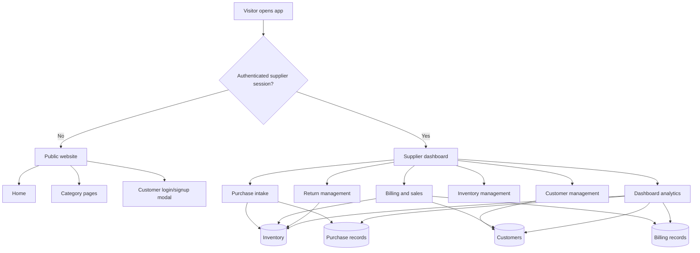
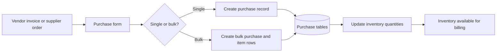
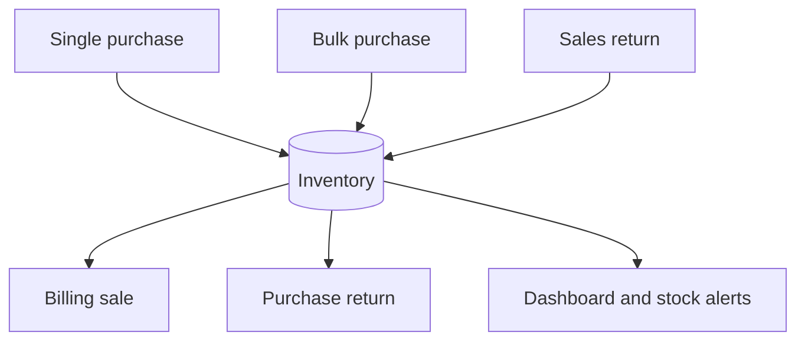

# Nayan Eye Care Project Flow

This document explains how the whole `opencode` project is meant to work end to end, based on the connected system diagram plus the current React codebase, services, and supporting docs.

The project is not a generic e-commerce app. It is an eyewear retail and supplier management system with two major sides:

- Public customer-facing catalog pages
- A protected supplier/staff operating panel used for purchase, billing, inventory, customers, returns, and reporting
## 1. System Goal

The intended business loop is:

1. Products are purchased from vendors or suppliers.
2. Those purchases increase central inventory.
3. Staff create bills for customers from available inventory.
4. Sales reduce inventory and update customer history.
5. Sales returns and purchase returns adjust inventory in the opposite direction.
6. The dashboard reads the live operational data and shows branch-wise and category-wise business performance.

Inventory is the center of the system. Almost every major workflow should either add to stock, remove from stock, or report on stock-driven business activity.

## 2. Main Actors

### Visitor / Customer

- Lands on the public site
- Browses product categories
- Can view the brand and catalog experience
- In the full target flow, should also be able to log in, view records, and place or track requests

### Supplier / Staff User

- Logs in through the header modal
- Enters purchases
- Creates bills
- Manages customers
- Reviews inventory
- Handles returns
- Uses dashboard analytics

### Backend + Data Layer

- Spring Boot APIs are the operational source of truth
- H2 database stores structured entities
- JSON files in `data/` act as backup or snapshot inputs for some flows
- `localStorage` and `sessionStorage` are currently used as temporary fallbacks in some modules

## 3. Top-Level Project Flow



## 4. Routing and Entry Flow

The app starts in `src/App.tsx`.

Current routing pattern:

- `/` shows the public home page unless a supplier session exists
- supplier sessions redirect to `/supplier/dashboard`
- supplier pages are protected through `ProtectedRoute`
- public category pages are:
  - `/spectacles`
  - `/sunglasses`
  - `/contact-lenses`
  - `/frames`
  - `/solutions`

Auth is coordinated through:

- `src/components/Header.tsx`
- `src/components/LoginModal.tsx`
- `src/services/authService.ts`

Expected auth flow:

1. User opens the app.
2. `authService.isAuthenticated()` checks session state.
3. If the user is a supplier, route them into the protected supplier panel.
4. If not authenticated, keep them on the public site.
5. Login/signup should eventually be backed by real backend auth for both supplier and customer roles.

Current implementation note:

- supplier login works through a mock-first flow in `authService.ts`
- auth state is kept in `sessionStorage`
- customer-facing account flow is not yet a complete working portal

## 5. Public Website Flow

The public site is mainly a presentation and discovery layer.

Current public flow:

1. User lands on `Home.tsx`.
2. They browse categories and featured products.
3. They can open login/signup from the header.
4. Real product purchase is still completed through the supplier billing workflow rather than an end-to-end online checkout flow.

How this side should work in the final system:

1. Browse live inventory-backed catalog data.
2. Register or log in as a customer.
3. Save prescription details or booking requests.
4. View bills, purchase history, and returns.
5. Connect smoothly into offline walk-in billing and future online order journeys.

## 6. Supplier Operations Flow

The supplier panel is the true operational core of the project.

### 6.1 Dashboard

Route: `/supplier/dashboard`

Purpose:

- Show business summary
- Track revenue, purchases, profit, customers, category mix, and branch performance

How it should work:

1. Read live purchase, billing, customer, inventory, and return data.
2. Aggregate by date range and branch.
3. Calculate revenue, COGS, gross profit, net profit, and stock alerts.
4. Surface low-stock and action-needed items.

Current implementation note:

- `dashboardService.ts` still reads JSON files under `data/`
- this means analytics can lag behind the live backend database

### 6.2 Purchase Intake

Routes:

- `/supplier/purchase`
- `/supplier/bulk-purchase`
- `/supplier/purchase-history`

Purpose:

- record stock coming in from vendors
- create the upstream source for inventory availability

Expected purchase flow:



Operational rules:

- every purchase must create or update inventory
- `productCode` should be the main stock identity
- stock increases after successful purchase save
- purchase history should allow review, edit, and deletion with inventory consistency

Current implementation note:

- single and bulk purchase flows are wired through frontend services
- local and file fallbacks still exist in purchase-related code for resilience

### 6.3 Inventory Hub

Route: `/supplier/inventory`

Inventory should be the central stock ledger for the entire system.

Stock movement rules:

- Purchase increases stock
- Bulk purchase increases stock
- Billing decreases stock
- Sales return increases stock
- Purchase return decreases stock
- Manual adjustments, if added, should create an audit trail



Target behavior:

- inventory must stay in sync with every business event
- low stock, out of stock, and reorder-needed states should be visible in UI
- movement history should be traceable for auditing

Current implementation note:

- the inventory service already exposes stock update methods
- return pages do not yet complete the inventory adjustment loop

### 6.4 Billing and Sales

Routes:

- `/supplier/billing`
- `/supplier/billing-records`

Purpose:

- sell products to customers
- generate invoice data
- reduce stock
- update customer business history

Expected billing flow:

1. Staff select or identify the customer.
2. Staff add products from available inventory.
3. The system calculates pricing, GST, discount, advance, and final payable amount.
4. Prescription details can be attached to the bill.
5. Billing record and billing product rows are saved.
6. Inventory quantities are reduced.
7. Customer stats are updated:
   - visit count
   - total spent
   - average bill
   - latest visit and bill references
8. The bill becomes available in sales history and downstream reporting.

This is the downstream consumer of inventory and the upstream source for customer analytics.

### 6.5 Customer Management

Route: `/supplier/customers`

Purpose:

- maintain customer master data
- merge direct customer records with sales history

How this should work:

1. Load customer master records from the backend.
2. Load billing records that reference customers.
3. Merge them by mobile number.
4. Present a unified customer view with lifetime value and visit history.
5. Allow create, edit, delete, search, and branch-aware management.

Current implementation note:

- the customer page already mixes backend and local/file persistence paths
- the merged view is one of the stronger business flows already present in the repo

### 6.6 Returns Management

Routes:

- `/supplier/sales-return`
- `/supplier/purchase-return`

These two flows are essential because they close the stock accuracy loop.

Sales return should work like this:

1. Find the original sale or bill.
2. Select the returned product and quantity.
3. Save a sales return record.
4. Restore inventory quantity.
5. Update customer and reporting impact.
6. Generate refund or credit-note style downstream effects if needed.

Purchase return should work like this:

1. Find the original purchase.
2. Select the returned-to-vendor item and quantity.
3. Save a purchase return record.
4. Deduct inventory quantity.
5. Update cost and reporting impact.
6. Generate debit-note style downstream effects if needed.

Current implementation note:

- both return pages currently rely on `localStorage`
- the intended final system should persist both to backend tables and update inventory immediately

## 7. Data and Source-of-Truth Model

The project currently uses multiple storage layers, but the desired operating model is clear:

### Primary source of truth

- Spring Boot APIs
- H2 database entities and tables

### Secondary or transitional support layers

- JSON files in `data/`
- `localStorage` fallbacks
- `sessionStorage` for auth session state

How the system should work long term:

1. UI writes operational data to backend APIs.
2. Backend updates database entities transactionally.
3. Dashboard and list views read from backend APIs, not stale snapshots.
4. JSON and browser storage remain optional backup or migration utilities, not the main runtime source.

## 8. Route-to-Responsibility Map

| Route | Role in the system |
|------|---------------------|
| `/` | Public entry and auth gateway |
| `/spectacles`, `/sunglasses`, `/contact-lenses`, `/frames`, `/solutions` | Public catalog browsing |
| `/supplier/dashboard` | Business summary and analytics |
| `/supplier/purchase` | Single purchase intake |
| `/supplier/bulk-purchase` | Multi-item purchase intake |
| `/supplier/purchase-history` | Historical purchase management |
| `/supplier/inventory` | Central stock view |
| `/supplier/billing` | Create customer sale and invoice |
| `/supplier/billing-records` | Sales history |
| `/supplier/customers` | Customer master and merged customer insights |
| `/supplier/sales-return` | Customer returns back into stock |
| `/supplier/purchase-return` | Supplier returns out of stock |
| `/supplier/data` | Placeholder management/reporting page |

## 9. What "Done Correctly" Looks Like

The project should behave as one continuous loop:

```text
Vendor purchase
-> inventory increases
-> staff sells to customer
-> inventory decreases
-> customer history updates
-> returns adjust inventory correctly
-> dashboard reports the real business position
```

If that loop is accurate, then:

- stock numbers match physical stock
- customer metrics match billing history
- profit reporting is trustworthy
- branch performance is comparable
- return handling does not distort inventory or P&L

## 10. Current Gaps To Close For The Full Target Flow

These are the main gaps between the current codebase and the full intended system flow:

- customer-side online account flow is incomplete
- auth is still mock-first instead of fully backend-driven
- dashboard still depends on JSON snapshots instead of live backend reads
- sales returns do not yet restore stock through the backend
- purchase returns do not yet deduct stock through the backend
- returns are not yet first-class backend entities
- inventory movement history is not yet a complete audited ledger

## 11. One-Line Summary

This project should work as a branch-aware eyewear retail operating system where purchases feed inventory, billing consumes inventory, returns correct inventory, customer records grow from sales activity, and the dashboard reports the live state of the business from the same underlying data.
