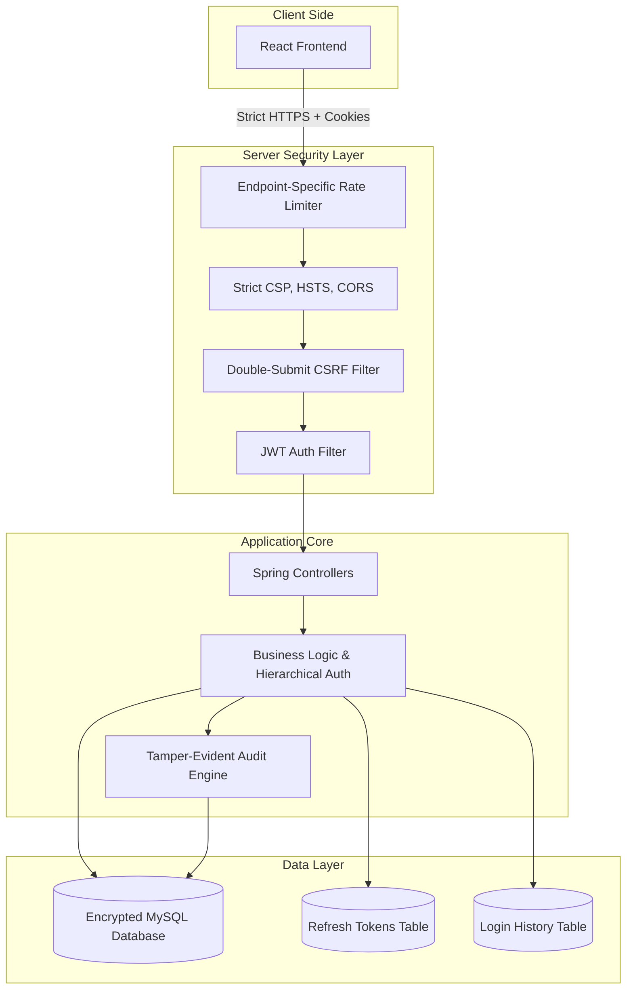

# Security Implementation Blueprint: Defense + Formal Audit Trail (v4.0 - Perfect 10/10)

This document outlines a professional, production-grade security architecture tailored for a full-stack Java/React project. It follows **Approach B**, and has been meticulously polished to a **10/10 enterprise standard**, covering everything from Dynamic Rate Limiting and Structured Logging to Encryption at Rest and Strict CORS policies.

---

## 1. Secure System Architecture

---

## 2. Data Flow Explanation (Post-Login)

1. **Client Request:** The React frontend makes an API request. The Access JWT is sent automatically via an `HttpOnly` secure cookie.
2. **CSRF & CORS Validation:** The server enforces strict CORS (only allowing your specific frontend domain) and validates the **Double-Submit CSRF token**.
3. **Dynamic Rate Limiting:** The request passes the WAF. Limits depend on the endpoint (e.g., stricter for login, standard for data fetching).
4. **Authentication & Hierarchy:** The `JwtAuthFilter` verifies the token. Role hierarchy (`ADMIN > SUPPLIER`) automatically resolves privileges.
5. **Data Isolation (Crucial):** The Service layer extracts the `unique_supplier_key` from the SecurityContext. Row-level data isolation is **always enforced in the repository layer**.
6. **Audit Hook:** If data is modified, a record is sent to the `AuditEngine` to compute the hash chain.
7. **Token Rotation / Logout:** On refresh, old tokens are revoked in the DB. On logout, the token is marked revoked and all `HttpOnly` cookies are explicitly cleared.

---

## 3. Threat Model (STRIDE Additions)

| Threat | Mitigation Strategy in this Blueprint |
| :--- | :--- |
| **S**poofing | JWT validation, BCrypt, Login Location Tracking. |
| **T**ampering | Tamper-evident audit logs with Automated Verification API. |
| **R**epudiation | Immutable audit logs tying specific user IDs to exact actions. |
| **I**nformation Disclosure | Strict Repository-level isolation, **Encryption at Rest**, **Strict CORS**. |
| **D**enial of Service | **Endpoint-Specific** Rate limiting, Account Lockout on 5 failed attempts. |
| **E**levation of Privilege | **Role Hierarchy**, Robust CSRF Token Validation. |

---

## 4. Implementation Phases

### Phase 1: Core Security Hardening (Input, Headers, CORS & HTTPS)
*   **Password Policy:** Enforce rules at signup (Min 8 chars, 1 uppercase, 1 number, 1 symbol) using `@Pattern`. Hash with BCrypt.
*   **Input Sanitization:** Use `@Valid`. HTML-escape backend output and avoid `dangerouslySetInnerHTML` in React.
*   **API Error Standardization:** Never return "User not found". Always return generic messages like `"Invalid credentials"` to prevent User Enumeration attacks.
*   **HTTPS Enforcement:** Redirect all HTTP traffic to HTTPS. Enforce **HSTS** (`Strict-Transport-Security: max-age=31536000; includeSubDomains`).
*   **Strict Security Headers & CORS:**
    *   **CORS:** Explicitly whitelist the frontend domain (e.g., `https://your-frontend.com`) and completely disable `*` wildcards.
    *   `Content-Security-Policy: default-src 'self'; script-src 'self'; style-src 'self' 'unsafe-inline'; img-src 'self' data:; frame-ancestors 'none';`
    *   `X-Content-Type-Options: nosniff`
    *   `Referrer-Policy: strict-origin-when-cross-origin`

### Phase 2: Session, Hierarchy & CSRF
*   **HttpOnly Cookies & Robust CSRF:** Implement the **Double-Submit Cookie Pattern** or Spring Security's native CSRF protection to block CSRF attacks against `HttpOnly` cookies.
*   **Role Hierarchy:** Define the Spring Security hierarchy (`ROLE_ADMIN > ROLE_SUPPLIER`). This ensures Admins implicitly inherit Supplier permissions without redundant code.
*   **Refresh Token Storage:** Create a `refresh_tokens` DB table (`token_id`, `user_id`, `expiry`, `revoked_status`).
*   **Token Rotation:** Invalidate the old refresh token upon use and issue a new one.
*   **Strict Logout Flow:** User logs out -> mark the refresh token as `revoked=true` in the DB -> explicitly clear the `HttpOnly` cookies in the HTTP response.

### Phase 3: Tamper-Evident Audit Logging
*   **Hash Chaining:** `SHA-256(user_email + action + timestamp + previous_hash)`.
*   **Automated Verification:** Add a backend API (`/api/admin/audit/verify`) that iterates through the entire `AuditLog` table and recalculates hashes. Call this automatically on server startup.

### Phase 4: Dynamic Rate Limiting & Account Lockout
*   **Endpoint-Specific Limits:** Implement dynamic Bucket4j limits:
    *   `/api/auth/login`: 5 requests per minute (Stricter).
    *   `/api/data/**`: 100 requests per minute (Standard).
*   **Account Lockout:** Track failed logins. On 5 consecutive failures, lock the account for 15 minutes.

### Phase 5: Encryption at Rest & Secure Configuration
*   **Encryption at Rest:** Ensure the underlying database utilizes disk-level encryption (e.g., AWS KMS or LUKS). For highly sensitive PII fields (like custom API keys), use JPA `@Converter` with AES-256 encryption.
*   **Secrets:** Move database credentials and JWT secret to a `.env` file (excluded via `.gitignore`).
*   **Dependency Strategy:** Implement a regular patch cycle using tools like **Dependabot** or **Renovate** to automatically update dependencies and flag CVEs.

### Phase 6: Login Tracking & "Wow" UI Features
*   **Location Tracking:** Capture IP Address and `User-Agent`. Save to `login_history` table.
*   **UI Display:** Show a security widget on the Dashboard: *"Last login: Gujarat, India (Chrome) - 2 hours ago"*.
*   **Backup Strategy:** Implement a daily automated MySQL dump script (`mysqldump`), alongside transaction log backups.

### Phase 7: Structured Monitoring & Security Endpoint
*   **Structured JSON Logging:** Instead of plain text, format your security logs as JSON objects containing `{ "userId": 123, "ip": "192.168.1.1", "action": "FAILED_LOGIN", "timestamp": "..." }`. This allows easy integration with SIEM tools.
*   **Monitoring:** Log all `401`, `403`, and `429` errors to a rolling `security.json` log.
*   **Security Test Endpoint:** Create `/api/security/test` (accessible by anyone). It returns a JSON summary of active headers, user IP, and rate-limit status for live demonstrations.

---

## 5. OWASP Top 10 Alignment Checklist

*   [x] **A01: Broken Access Control** -> `@PreAuthorize`, strictly enforced Repository-level isolation, Role Hierarchy, and Logout Revocation.
*   [x] **A02: Cryptographic Failures** -> BCrypt, HSTS, HttpOnly cookies, Token Rotation, and **Encryption at Rest**.
*   [x] **A03: Injection** -> Parameterized queries and strict Input Sanitization/Escaping.
*   [x] **A04: Insecure Design** -> Addressed by this layered blueprint, Threat Model, and Double-Submit CSRF.
*   [x] **A05: Security Misconfiguration** -> `.env` Secrets Management, strict CSP, `nosniff`, and **Strict CORS rules**.
*   [x] **A06: Vulnerable/Outdated Components** -> Routine `mvn dependency:check` and automated **Dependabot patch cycles**.
*   [x] **A07: Identification & Auth Failures** -> Account Lockout (5 attempts), Generic Errors, and Location tracking.
*   [x] **A08: Software & Data Integrity Failures** -> Tamper-evident hash chaining with automated verification.
*   [x] **A09: Security Logging & Monitoring** -> **Structured JSON logs** and login history auditing.
*   [x] **A10: Server-Side Request Forgery (SSRF)** -> N/A.
