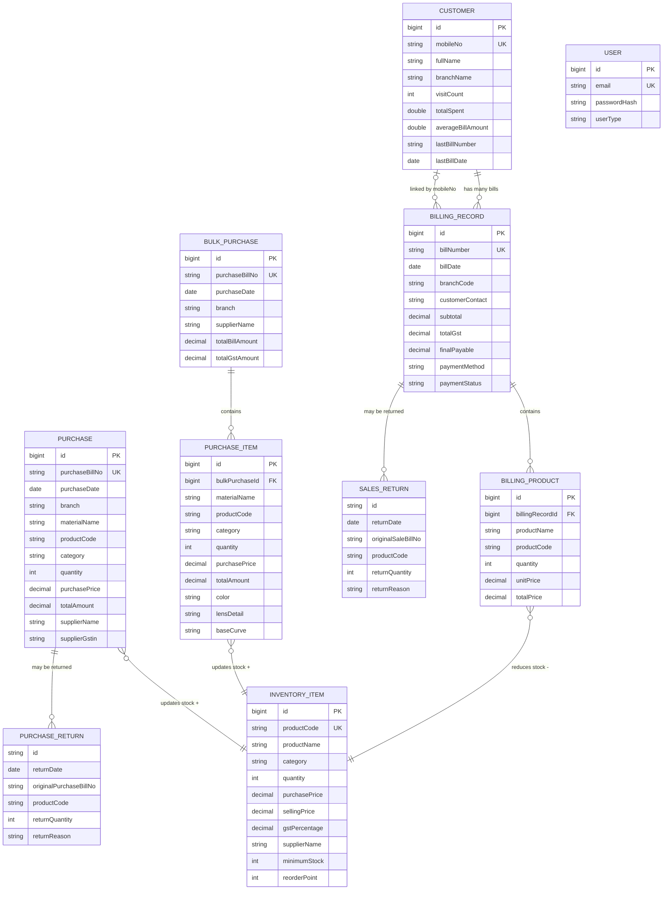

# Part 7 — Database Schema & ER Diagram

> 📂 Part of the [System Architecture Docs](./00_INDEX.md)

---

## 📐 Full Database Schema

```
purchases (id PK, purchase_bill_no UNIQUE, purchase_date, branch, material_name,
           product_code, product_description, category ENUM, subcategory, hsn,
           quantity, purchase_price, input_gst_percent, input_gst_amount, total_amount,
           supplier_name, supplier_address, supplier_gstin, remarks, created_at, updated_at)

bulk_purchases (id PK, purchase_bill_no UNIQUE, purchase_date, branch,
                supplier_name, supplier_address, supplier_gstin, remarks,
                total_bill_amount, total_gst_amount, created_at, updated_at)

purchase_items (id PK, bulk_purchase_id FK→bulk_purchases.id,
               material_name, product_code, product_description, category ENUM,
               subcategory, hsn, quantity, purchase_price, input_gst_percent,
               input_gst_amount, total_amount,
               [Spectacles/Frames: color, size, type, gender, shape, material, temple_details, bridge_size]
               [Lens: lens_detail, lens_coating, design, lens_index, lens_number, lens_addition, lens_axis]
               [Contact Lens: lens_product_name, ct, base_curve, diameter, modality, validity, water_content, dkt]
               [Solutions: solution_name, variant, packing_type]
               [Other: name])

inventory_items (id PK, product_code UNIQUE, product_name, category, subcategory,
                description, hsn_code, quantity←STOCK, purchase_price, selling_price,
                gst_percentage, supplier_name, supplier_address, supplier_gstin,
                purchase_date, expiry_date, minimum_stock, maximum_stock,
                reorder_point, remarks, created_at, updated_at)

customers (id PK, mobile_no UNIQUE, full_name, branch_name, branch_code, title, mobile_no2,
           gender ENUM, gstin_no, date_of_birth, age, notes, email, city, anniversary,
           date_of_visit, last_visit_date, visit_count, total_spent, average_bill_amount,
           last_bill_number, last_bill_date, source ENUM, created_at, updated_at)

billing_records (id PK, bill_number UNIQUE, bill_date, branch_code, branch_name,
                customer_name, customer_contact, customer_email, customer_address,
                lens_power_right, lens_power_left, pd,
                sph_right, cyl_right, axis_right, pd_right,
                sph_left, cyl_left, axis_left, pd_left, additional_notes,
                subtotal, total_gst, amount, discount, advance_paid, final_payable,
                payment_method, transaction_ref, payment_status,
                warranty_details, return_policy, prescription_delivery_date,
                authorized_signatory, customer_id FK→customers.id,
                created_at, updated_at)

billing_products (id PK, billing_record_id FK→billing_records.id,
                 product_name, product_code, category, quantity,
                 unit_price, gst_percentage, total_price)

users (id PK, email UNIQUE, phone, password_hash, user_type ENUM,
       first_name, last_name, company_name, gstin_number, business_address, address)
```

---

## 🔗 Entity Relationships

```
purchases ──────────────── inventory_items   (product_code → stock +qty)
bulk_purchases ──1:N───── purchase_items     (cascade save/delete)
purchase_items ─────────── inventory_items   (product_code → stock +qty)
billing_records ──N:1──── customers          (customer_id FK)
billing_records ──1:N──── billing_products   (cascade save)
billing_products ──────── inventory_items    (product_code → stock -qty)
```

---

## 🎯 Mermaid ER Diagram



---

## 📐 Draw.io Import Instructions

1. Open [draw.io](https://app.diagrams.net)
2. Go to **Extras → Edit Diagram**
3. Paste the XML below and click **OK**

```xml
<?xml version="1.0" encoding="UTF-8"?>
<mxGraphModel dx="1422" dy="762" grid="1" gridSize="10" guides="1" tooltips="1" connect="1" arrows="1" fold="1" page="1" pageScale="1" pageWidth="1654" pageHeight="1169" math="0" shadow="0">
  <root>
    <mxCell id="0" /><mxCell id="1" parent="0" />
    <mxCell id="10" value="&lt;b&gt;Purchase&lt;/b&gt;&#xa;id PK&#xa;purchaseBillNo (UNIQUE)&#xa;purchaseDate / branch&#xa;materialName / productCode&#xa;category (ENUM)&#xa;quantity / purchasePrice&#xa;inputGSTAmount / totalAmount&#xa;supplierName / supplierGstin" style="shape=table;startSize=30;collapsible=0;fontStyle=1;align=center;fillColor=#dae8fc;strokeColor=#6c8ebf;" vertex="1" parent="1"><mxGeometry x="30" y="60" width="200" height="220" as="geometry" /></mxCell>
    <mxCell id="20" value="&lt;b&gt;BulkPurchase&lt;/b&gt;&#xa;id PK&#xa;purchaseBillNo (UNIQUE)&#xa;purchaseDate / branch&#xa;supplierName / supplierGstin&#xa;totalBillAmount / totalGstAmount" style="shape=table;startSize=30;collapsible=0;fontStyle=1;align=center;fillColor=#dae8fc;strokeColor=#6c8ebf;" vertex="1" parent="1"><mxGeometry x="260" y="60" width="200" height="180" as="geometry" /></mxCell>
    <mxCell id="30" value="&lt;b&gt;PurchaseItem&lt;/b&gt;&#xa;id PK / FK: bulkPurchaseId&#xa;materialName / productCode&#xa;category / quantity&#xa;purchasePrice / totalAmount&#xa;[color, size, shape]&#xa;[lensDetail, lensIndex]&#xa;[baseCurve, modality]&#xa;[solutionName, variant]" style="shape=table;startSize=30;collapsible=0;fontStyle=1;align=center;fillColor=#dae8fc;strokeColor=#6c8ebf;" vertex="1" parent="1"><mxGeometry x="260" y="280" width="200" height="240" as="geometry" /></mxCell>
    <mxCell id="40" value="&lt;b&gt;InventoryItem&lt;/b&gt;&#xa;id PK&#xa;productCode (UNIQUE)&#xa;productName / category&#xa;quantity ← STOCK&#xa;purchasePrice / sellingPrice&#xa;gstPercentage&#xa;supplierName&#xa;minimumStock / reorderPoint" style="shape=table;startSize=30;collapsible=0;fontStyle=1;align=center;fillColor=#d5e8d4;strokeColor=#82b366;" vertex="1" parent="1"><mxGeometry x="500" y="160" width="200" height="240" as="geometry" /></mxCell>
    <mxCell id="50" value="&lt;b&gt;Customer&lt;/b&gt;&#xa;id PK&#xa;mobileNo (UNIQUE)&#xa;fullName / branchName&#xa;gender / email / city&#xa;visitCount / totalSpent&#xa;averageBillAmount&#xa;lastBillNumber / lastBillDate" style="shape=table;startSize=30;collapsible=0;fontStyle=1;align=center;fillColor=#ffe6cc;strokeColor=#d6b656;" vertex="1" parent="1"><mxGeometry x="740" y="60" width="200" height="240" as="geometry" /></mxCell>
    <mxCell id="60" value="&lt;b&gt;BillingRecord (Sales)&lt;/b&gt;&#xa;id PK / billNumber (UNIQUE)&#xa;billDate / branchCode&#xa;customerName / customerContact&#xa;[Prescription fields]&#xa;subtotal / totalGst&#xa;discount / finalPayable&#xa;paymentMethod / paymentStatus&#xa;FK: customer_id" style="shape=table;startSize=30;collapsible=0;fontStyle=1;align=center;fillColor=#ffe6cc;strokeColor=#d6b656;" vertex="1" parent="1"><mxGeometry x="980" y="60" width="210" height="260" as="geometry" /></mxCell>
    <mxCell id="70" value="&lt;b&gt;BillingProduct&lt;/b&gt;&#xa;id PK&#xa;FK: billingRecordId&#xa;productName / productCode&#xa;category / quantity&#xa;unitPrice / gstPercentage&#xa;totalPrice" style="shape=table;startSize=30;collapsible=0;fontStyle=1;align=center;fillColor=#ffe6cc;strokeColor=#d6b656;" vertex="1" parent="1"><mxGeometry x="1230" y="160" width="190" height="200" as="geometry" /></mxCell>
    <mxCell id="80" value="&lt;b&gt;SalesReturn&lt;/b&gt;&#xa;⚠️ localStorage ONLY&#xa;id / returnDate&#xa;originalSaleBillNo&#xa;productCode / returnQuantity&#xa;returnReason / totalAmount&#xa;&#xa;❌ NOT in DB&#xa;❌ Does NOT update inventory" style="shape=table;startSize=30;collapsible=0;fontStyle=1;align=center;fillColor=#f8cecc;strokeColor=#b85450;" vertex="1" parent="1"><mxGeometry x="1230" y="400" width="190" height="220" as="geometry" /></mxCell>
    <mxCell id="90" value="&lt;b&gt;PurchaseReturn&lt;/b&gt;&#xa;⚠️ localStorage ONLY&#xa;id / returnDate&#xa;originalPurchaseBillNo&#xa;productCode / returnQuantity&#xa;returnReason / totalAmount&#xa;&#xa;❌ NOT in DB&#xa;❌ Does NOT update inventory" style="shape=table;startSize=30;collapsible=0;fontStyle=1;align=center;fillColor=#f8cecc;strokeColor=#b85450;" vertex="1" parent="1"><mxGeometry x="30" y="340" width="200" height="220" as="geometry" /></mxCell>
    <mxCell id="100" value="&lt;b&gt;User&lt;/b&gt;&#xa;id PK&#xa;email (UNIQUE)&#xa;passwordHash&#xa;userType (ENUM)&#xa;firstName / lastName&#xa;companyName / gstNumber" style="shape=table;startSize=30;collapsible=0;fontStyle=1;align=center;fillColor=#e1d5e7;strokeColor=#9673a6;" vertex="1" parent="1"><mxGeometry x="740" y="360" width="200" height="190" as="geometry" /></mxCell>
    <mxCell id="r1" style="edgeStyle=orthogonalEdgeStyle;endArrow=ERmany;startArrow=ERone;" edge="1" parent="1" source="20" target="30"><mxGeometry relative="1" as="geometry"/></mxCell>
    <mxCell id="r2" value="stock +" style="edgeStyle=orthogonalEdgeStyle;endArrow=open;dashed=1;strokeColor=#82b366;" edge="1" parent="1" source="10" target="40"><mxGeometry relative="1" as="geometry"/></mxCell>
    <mxCell id="r3" value="stock +" style="edgeStyle=orthogonalEdgeStyle;endArrow=open;dashed=1;strokeColor=#82b366;" edge="1" parent="1" source="30" target="40"><mxGeometry relative="1" as="geometry"/></mxCell>
    <mxCell id="r4" style="edgeStyle=orthogonalEdgeStyle;endArrow=ERone;startArrow=ERmany;" edge="1" parent="1" source="60" target="50"><mxGeometry relative="1" as="geometry"/></mxCell>
    <mxCell id="r5" style="edgeStyle=orthogonalEdgeStyle;endArrow=ERmany;startArrow=ERone;" edge="1" parent="1" source="60" target="70"><mxGeometry relative="1" as="geometry"/></mxCell>
    <mxCell id="r6" value="stock -" style="edgeStyle=orthogonalEdgeStyle;endArrow=open;dashed=1;strokeColor=#b85450;" edge="1" parent="1" source="70" target="40"><mxGeometry relative="1" as="geometry"/></mxCell>
    <mxCell id="r7" style="edgeStyle=orthogonalEdgeStyle;endArrow=ERmany;startArrow=ERone;dashed=1;strokeColor=#b85450;" edge="1" parent="1" source="60" target="80"><mxGeometry relative="1" as="geometry"/></mxCell>
    <mxCell id="r8" style="edgeStyle=orthogonalEdgeStyle;endArrow=ERmany;startArrow=ERone;dashed=1;strokeColor=#b85450;" edge="1" parent="1" source="10" target="90"><mxGeometry relative="1" as="geometry"/></mxCell>
  </root>
</mxGraphModel>
```
