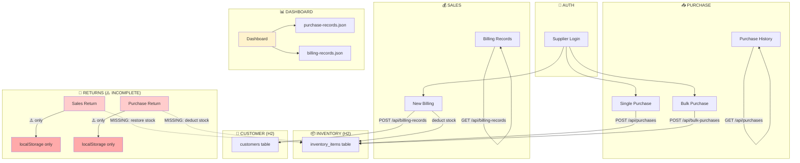

# Part 8 — Gaps, Issues & Summary

> 📂 Part of the [System Architecture Docs](./00_INDEX.md)

---

## 🚨 Critical Gaps

| # | Gap | File / Location | Impact |
|---|-----|----------------|--------|
| 1 | **Sales Return does NOT update inventory** | `SalesReturn.tsx` | Stock shows lower than actual after customer returns |
| 2 | **Purchase Return does NOT update inventory** | `PurchaseReturn.tsx` | Stock shows higher than actual after supplier returns |
| 3 | **Returns not stored in backend DB** | Both return pages | All return data is lost if localStorage is cleared |
| 4 | **No `SalesReturn` Java entity** | `src/main/java/.../entity/` | No REST API, no persistence for sales returns |
| 5 | **No `PurchaseReturn` Java entity** | `src/main/java/.../entity/` | No REST API, no persistence for purchase returns |
| 6 | **Dashboard reads JSON files, not live DB** | `dashboardService.ts` | Analytics may show stale/empty data if JSON not synced |

---

## ⚠️ Design Inconsistencies

| # | Issue | Location |
|---|-------|----------|
| 1 | `SalesReturn.tsx` loads sales from `localStorage['salesRecords']` but actual sales live in `billing_records` DB table | `SalesReturn.tsx` line 147 |
| 2 | TypeScript `inventory.ts` defines `movements[]` array but Java `InventoryItem.java` has no such field — no audit trail in DB | `inventory.ts` vs `InventoryItem.java` |
| 3 | TypeScript uses `currentStock` field name; Java entity uses `quantity` | Field naming mismatch |
| 4 | Auth is fully mocked — hardcoded credentials (`siddhesh@amityonline.com` / `Sameer123`) | `authService.ts` |
| 5 | Bulk purchase applies **30% markup** for selling price (hardcoded `× 1.30`) | `BulkPurchaseService.java` line 157 |
| 6 | Single Purchase does **NOT** apply the 30% markup — selling price left blank | `PurchaseService.java` |
| 7 | Dashboard `processSalesData()` counts each sold item as `amount: 1` (quantity-based, not price-based) | `dashboardService.ts` |
| 8 | Low stock warnings only print to server console — never surfaced to the frontend UI | `BillingRecordService.java` |
| 9 | `sessionStorage` used for auth token — session lost on every browser tab close | `authService.ts` |

---

## ✅ What Works (Implemented & Functional)

| Feature | Status |
|---------|--------|
| Single purchase → H2 DB → inventory auto-increment | ✅ |
| Bulk purchase → H2 DB (with items) → inventory auto-increment | ✅ |
| New billing (sale) → H2 DB → inventory auto-decrement | ✅ |
| Customer management (CRUD via backend API) | ✅ |
| Purchase history (view, edit, delete from backend) | ✅ |
| Billing records (view from backend) | ✅ |
| Dashboard P&L calculations (from JSON files) | ✅ |
| Authentication (mock + JWT backend support) | ✅ |
| Multi-branch support (DIGL, MAYA, RANG, JUNG) | ✅ |
| Category breakdown (Spectacles/Sunglasses/Lens/Contact Lens/Frame/Solution) | ✅ |
| Customer stats auto-update on billing (visitCount, totalSpent, etc.) | ✅ |
| 30% markup auto-applied on bulk purchase inventory create | ✅ |
| Low stock detection (server-side logging) | ✅ |
| CSV export for purchase, sales, customer, return pages | ✅ |
| Pagination on all list pages | ✅ |

---

## ❌ What's Missing / Incomplete

| Feature | Status | Priority |
|---------|--------|----------|
| Sales Return → backend API (`POST /api/sales-returns`) | ❌ | 🔴 High |
| Sales Return → inventory restore (`quantity += returnQty`) | ❌ | 🔴 High |
| Purchase Return → backend API (`POST /api/purchase-returns`) | ❌ | 🔴 High |
| Purchase Return → inventory deduction (`quantity -= returnQty`) | ❌ | 🔴 High |
| `SalesReturn` Java entity + DB table | ❌ | 🔴 High |
| `PurchaseReturn` Java entity + DB table | ❌ | 🔴 High |
| Dashboard reading from backend API (not JSON files) | ❌ | 🟡 Medium |
| Inventory `movements[]` / audit trail in backend | ❌ | 🟡 Medium |
| Real authentication (backend user management) | ❌ | 🟡 Medium |
| Low stock push notifications / UI alerts | ❌ | 🟡 Medium |
| `inventory-records.json` auto-sync from backend | ❌ | 🟡 Medium |
| Return transactions affecting P&L in dashboard | ❌ | 🟡 Medium |
| Selling price for single purchases (no markup logic) | ❌ | 🟢 Low |
| mobileNo uniqueness enforced on frontend validation | ❌ | 🟢 Low |

---

## 🛠️ Recommended Fix Order

### Phase 1: Fix Returns (Critical)
1. Create `SalesReturn.java` entity + repository + controller
2. Create `PurchaseReturn.java` entity + repository + controller
3. Update `SalesReturn.tsx` to call `POST /api/sales-returns` + restore inventory
4. Update `PurchaseReturn.tsx` to call `POST /api/purchase-returns` + deduct inventory

### Phase 2: Fix Dashboard Data Source
5. Update `dashboardService.ts` to fetch from backend APIs instead of JSON files
6. Remove reliance on `purchase-records.json`, `billing-records.json` etc. for live data

### Phase 3: Polish
7. Add frontend low stock alerts/badges on inventory page
8. Add real authentication (remove hardcoded mock credentials)
9. Add consistent 30% markup logic to single purchases too
10. Add inventory movement history tracking

---

## 📊 Full System Data Flow (Mermaid Flowchart)

