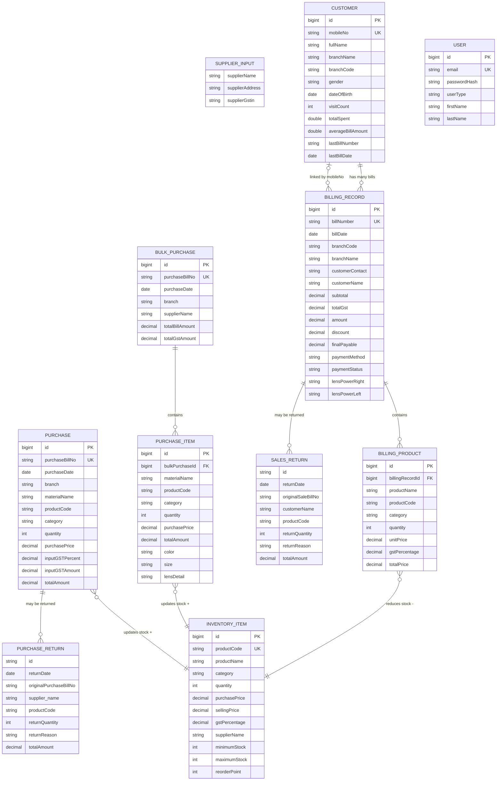

# 🏥 Nayan Eye Care — Complete System Architecture Analysis

> **Full-stack system**: React (Vite + TypeScript) frontend + Spring Boot (Java) backend + H2 database  
> **Backend API**: `http://localhost:8080/api`  
> **Branches**: DIGL (Diglipur), MAYA (Mayabunder), RANG (Rangat), JUNG (Junglighat)

---

## 📦 Technology Stack

| Layer | Technology |
|-------|-----------|
| Frontend | React 18 + TypeScript + Vite + TailwindCSS |
| Backend | Spring Boot (Java) + JPA/Hibernate |
| Database | H2 (embedded, file: `data/nayan-db.mv.db`) |
| Auth | JWT (sessionStorage) + Mock fallback |
| File Storage | JSON files (`data/`) + localStorage fallback |

---

## 🗂️ Module Overview

| Module | Route | Description |
|--------|-------|-------------|
| Dashboard | `/supplier/dashboard` | Analytics, P&L, charts |
| Purchase (Single) | `/supplier/purchase` | One product per bill |
| Bulk Purchase | `/supplier/bulk-purchase` | Multiple products per bill |
| Purchase History | `/supplier/purchase-history` | View/edit/delete purchases |
| Purchase Return | `/supplier/purchase-return` | Return goods to supplier |
| Inventory | `/supplier/inventory` | Stock tracking |
| New Billing | `/supplier/billing` | Create sales invoice |
| Billing Records | `/supplier/billing-records` | Sales history |
| Customers | `/supplier/customers` | Customer management |
| Sales Return | `/supplier/sales-return` | Return from customer |

---

## 🔄 1. Supplier & Purchase Flow

### Single Purchase (`purchaseService.ts` → Java `PurchaseService.java`)

```
User fills Purchase Form
        ↓
purchaseService.appendPurchaseData(purchaseData)
        ↓  
  → POST /api/purchases (backend)
  → Backend saves to H2 `purchases` table
  → Backend auto-creates/updates InventoryItem  ← KEY STEP
        ↓
purchaseService.saveToLocalFile()  (backup to JSON)
        ↓
inventoryService.refreshInventory()  (refresh frontend cache)
```

**PurchaseData fields** (frontend TS interface):
- `id`, `purchaseBillNo` (unique), `purchaseDate`, `branch`
- `materialName`, `productCode`, `productDescription`
- `category` (enum: Spectacles/Sunglasses/Lens/Contact Lens/Frame/Solution/Other/Non-Chargeable)
- `subcategory`, `hsn`, `quantity`, `purchasePrice`
- `inputGSTPercent`, `inputGSTAmount`, `totalAmount`
- `supplier: { name, address, gstin }`, `remarks`

### Bulk Purchase (`bulkPurchaseService.ts` → Java `BulkPurchaseService.java`)

```
User fills Bulk Purchase Form (multiple items)
        ↓
bulkPurchaseService.createBulkPurchase(bulkPurchaseData)
        ↓
  → POST /api/bulk-purchases (backend)
  → Creates BulkPurchase + PurchaseItems (cascade)
  → For EACH PurchaseItem:
       if inventory exists for productCode → ADD quantity
       if not exists → CREATE new InventoryItem (30% markup for selling price)
        ↓
Both Single & Bulk purchases update the SAME inventory_items table
```

---

## 📦 2. Inventory System

### Stock Increment (after Purchase)
- **Single Purchase** → Java `PurchaseService.updateInventoryFromPurchase()` 
  - finds by `productCode` → updates `quantity`
  - if not found → creates new `InventoryItem`
  
- **Bulk Purchase** → Java `BulkPurchaseService.updateInventoryFromBulkPurchase()`
  - iterates all `PurchaseItems`
  - same logic: find by `productCode` → add quantity or create new

### Stock Decrement (after Sale)
- `BillingRecordService.reduceInventoryFromSale()`
  - iterates `BillingProduct` list in billing record
  - finds `InventoryItem` by `productCode` (fallback: by name)
  - `newQuantity = max(0, currentQuantity - soldQuantity)`
  - saves updated `InventoryItem`

### Stock Adjustment (Returns)
> ⚠️ **GAP IDENTIFIED**: Both `SalesReturn.tsx` and `PurchaseReturn.tsx` currently save returns **only to `localStorage`** — they do NOT call the backend to update inventory!

**SalesReturn** (current behavior):
- Creates `SalesReturnRecord` with: returnDate, originalSaleBillNo, customerInfo, productInfo, returnQuantity, returnReason
- Saves to `localStorage['salesReturns']`
- ❌ Does NOT reverse the inventory decrement

**PurchaseReturn** (current behavior):
- Creates `PurchaseReturnRecord` with: returnDate, originalPurchaseBillNo, supplierInfo, productInfo, returnQuantity, returnReason
- Saves to `localStorage['purchaseReturns']`
- When deleting a Purchase Return, it DOES try to restore purchase quantity in localStorage
- ❌ Does NOT call backend API to reverse inventory

---

## 👥 3. Customer & Sales Flow

### Customer Data Sources (merged)
```
Source 1: customers table (API /api/customers)
         ↓ via CustomerService.java
         
Source 2: billing_records table (API /api/billing-records)
         ↓ via BillingRecordService.java
         
billingService.mergeCustomerAndBillingData()
         ↓
Unified CustomerBillingSummary (source: 'customer_record' | 'billing_record' | 'combined')
```

**Customer fields**: id, branchName, branchCode, title, fullName, mobileNo (UNIQUE), mobileNo2, gender, gstinNo, dateOfBirth, age, notes, email, city, anniversary, dateOfVisit, lastVisitDate, visitCount, totalSpent, averageBillAmount, lastBillNumber, lastBillDate

### Sales / Billing Flow
```
New Billing Page (NewBilling.tsx)
        ↓
User selects Customer + adds Products from Inventory
        ↓
POST /api/billing-records
        ↓
BillingRecordService.createBillingRecord()
        ├── Looks up Customer by mobileNo
        ├── Links BillingRecord ↔ Customer (FK: customer_id)
        ├── Updates Customer: visitCount++, totalSpent, averageBillAmount, lastBillNumber, lastBillDate
        └── reduceInventoryFromSale() → decrements InventoryItem.quantity for each product
```

**BillingRecord fields**: id, billNumber (unique), billDate, branchCode, branchName, customerName, customerContact, customerEmail, customerAddress, Eye Prescription (lensPowerRight/Left, sph/cyl/axis/pd for both eyes), subtotal, totalGst, amount, discount, advancePaid, finalPayable, paymentMethod, paymentStatus, warrantyDetails, returnPolicy, prescriptionDeliveryDate, authorizedSignatory, products (OneToMany → BillingProduct)

---

## 🔄 4. Return Management

### Sales Return Lifecycle
```
Customer returns product
        ↓
SalesReturn.tsx → handleSaveReturn()
        ↓
Creates SalesReturnRecord: {
  returnDate, originalSaleBillNo, serialNo, branch,
  customerName/Contact/Email/Address,
  productName/Code, category, subcategory, hsn,
  returnQuantity, originalQuantity,
  salePrice, outputGSTPercent, outputGSTAmount, totalAmount,
  returnReason, remarks
}
        ↓
localStorage['salesReturns']
        ↓
⚠️ MISSING: Should → POST /api/billing-records/{id}/return
⚠️ MISSING: Should → inventoryService.addStock() to restore quantity
⚠️ MISSING: Should → update financial records (reduce sales revenue)
```

### Purchase Return Lifecycle
```
Supplier is sent goods back
        ↓
PurchaseReturn.tsx → handleSaveReturn()
        ↓
Creates PurchaseReturnRecord: {
  returnDate, originalPurchaseBillNo, branch,
  materialName, productCode, category, hsn,
  returnQuantity, originalQuantity,
  purchasePrice, inputGSTPercent, inputGSTAmount, totalAmount,
  returnReason, supplier: { name, address, gstin }, remarks
}
        ↓
localStorage['purchaseReturns']
        ↓
⚠️ MISSING: Should → PUT /api/purchases/{id} to reduce quantity
⚠️ MISSING: Should → inventoryService.removeStock() to reduce quantity
⚠️ MISSING: Should → update financial records (reduce purchase cost)
```

---

## 📊 5. Dashboard & Analytics

### Data Sources (dashboardService.ts)
```
getDashboardData(timeFilter, year)
  ├── readDataFile('purchase-records.json')   → PurchaseData[]
  ├── readDataFile('billing-records.json')    → SalesData[]
  ├── readDataFile('customer-records.json')   → Customer[]
  └── readDataFile('inventory-records.json')  → InventoryItem[]
```

> ⚠️ **GAP**: Dashboard reads from JSON FILES (not the backend API). This means if data is only in the H2 database (not synced to JSON), the dashboard will show stale/empty data.

### Profit & Loss Calculation
```
Net Profit = Total Sales Revenue - Cost of Goods Sold (COGS)

COGS per product = (unitCost from InventoryItem × quantity_sold) + GST on cost
                         ↑
               Matched by productName or productCode or category

Profit Margin = (Net Profit / Total Sales) × 100%

Monthly Growth = (Current Month Sales - Previous Month Sales) / Previous Month Sales × 100%
```

### Summary Stats Structure
```typescript
SummaryStats {
  totalPurchases: number   // Sum of purchase amounts
  totalSales: number       // Sum of final billing amounts
  netProfit: number        // totalSales - COGS
  profitMargin: number     // %
  activeCustomers: number  // Unique names from Customer + BillingRecord
  monthlyGrowth: number    // %
}
```

### Category Breakdown
- **Sales**: counted by **quantity** (not monetary amount, each item sold = 1)
- **Purchases**: aggregated by monetary amount
- Percentage = category_sales_count / total_items_sold × 100

### Branch Performance
- Branches: DIGL, MAYA, RANG, JUNG
- Aggregates sales + purchase amounts per branch
- Profit per branch = branch_sales - branch_purchases

---

## 🚨 6. Identified Gaps & Issues

### Critical Gaps

| # | Gap | Location | Impact |
|---|-----|----------|--------|
| 1 | **Sales Return does NOT update inventory** | `SalesReturn.tsx` | Stock levels wrong after customer return |
| 2 | **Purchase Return does NOT update inventory** | `PurchaseReturn.tsx` | Stock levels wrong after supplier return |
| 3 | **Dashboard reads JSON files, not DB** | `dashboardService.ts` | Analytics may show stale data |
| 4 | **Returns not stored in backend DB** | Both return pages | Data loss on localStorage clear |
| 5 | **No `SalesReturn` entity in Java** | `src/main/java/.../entity/` | No backend support for returns |
| 6 | **No `PurchaseReturn` entity in Java** | `src/main/java/.../entity/` | No backend support for returns |

### Design Inconsistencies

| # | Issue | Location |
|---|-------|----------|
| 1 | `SalesReturn` references `salesRecords` from localStorage but the actual sales are `BillingRecords` in DB | `SalesReturn.tsx` line 147 |
| 2 | Inventory `movements[]` array defined in TypeScript type but NOT in Java entity | `inventory.ts` vs `InventoryItem.java` |
| 3 | `InventoryItem.ts` has `currentStock` but Java entity uses `quantity` | Field naming inconsistency |
| 4 | Auth is mock only (hardcoded: siddhesh@amityonline.com / Sameer123) | `authService.ts` |
| 5 | Selling price formula in bulk purchase: `purchasePrice × 1.30` (30% margin) — hardcoded | `BulkPurchaseService.java` line 157 |
| 6 | Single Purchase does NOT have the 30% markup logic | `PurchaseService.java` |
| 7 | Dashboard `processSalesData` uses `amount: 1` per item (count) not actual price | `dashboardService.ts` line 133 |

---

## 📐 Database Schema (ER Summary)

```
purchases (id PK, purchase_bill_no UNIQUE, purchase_date, branch, material_name, 
           product_code, product_description, category ENUM, subcategory, hsn,
           quantity, purchase_price, input_gst_percent, input_gst_amount, total_amount,
           supplier_name, supplier_address, supplier_gstin, remarks, created_at, updated_at)

bulk_purchases (id PK, purchase_bill_no UNIQUE, purchase_date, branch,
                supplier_name, supplier_address, supplier_gstin, remarks,
                total_bill_amount, total_gst_amount, created_at, updated_at)

purchase_items (id PK, bulk_purchase_id FK→bulk_purchases.id,
               material_name, product_code, product_description, category ENUM,
               subcategory, hsn, quantity, purchase_price, input_gst_percent,
               input_gst_amount, total_amount,
               [conditional: color, size, type, gender, shape, material, etc.])

inventory_items (id PK, product_name, product_code UNIQUE, category, subcategory,
                description, hsn_code, quantity, purchase_price, selling_price,
                gst_percentage, supplier_name, supplier_address, supplier_gstin,
                purchase_date, expiry_date, minimum_stock, maximum_stock,
                reorder_point, remarks, created_at, updated_at)

customers (id PK, branch_name, branch_code, title, full_name, mobile_no UNIQUE, mobile_no2,
           gender ENUM, gstin_no, date_of_birth, age, notes, email, city, anniversary,
           date_of_visit, last_visit_date, visit_count, total_spent, average_bill_amount,
           last_bill_number, last_bill_date, source ENUM, created_at, updated_at)

billing_records (id PK, bill_number UNIQUE, bill_date, branch_code, branch_name,
                customer_name, customer_contact, customer_email, customer_address,
                [eye prescription fields: sph/cyl/axis/pd for R+L],
                subtotal, total_gst, amount, discount, advance_paid, final_payable,
                payment_method, transaction_ref, payment_status,
                warranty_details, return_policy, prescription_delivery_date,
                authorized_signatory, customer_id FK→customers.id,
                created_at, updated_at)

billing_products (id PK, billing_record_id FK→billing_records.id,
                 product_name, product_code, category, quantity,
                 unit_price, gst_percentage, total_price)

users (id PK, email UNIQUE, phone, password_hash, user_type ENUM, 
       first_name, last_name, company_name, gstin_number, business_address, address)
```

---

## 🔗 Entity Relationships

```
purchases ──────────────── inventory_items (product_code → update stock +qty)
bulk_purchases ──1:N───── purchase_items
purchase_items ─────────── inventory_items (product_code → update stock +qty)
billing_records ──N:1──── customers (customer_id FK)
billing_records ──1:N──── billing_products
billing_products ──────── inventory_items (product_code → deduct stock -qty)
```

---

## 🎯 Mermaid Diagram



---

## 🔀 Full Data Flow Diagram (Mermaid Flowchart)

```mermaid
flowchart TD
    subgraph AUTH["🔐 AUTH LAYER"]
        LOGIN["Supplier Login\n(mock or JWT)"]
    end

    subgraph PURCHASE_FLOW["📥 PURCHASE FLOW"]
        SP["Single Purchase Form\n/supplier/purchase"]
        BP["Bulk Purchase Form\n/supplier/bulk-purchase"]
        PH["Purchase History\n/supplier/purchase-history"]
    end

    subgraph PURCHASE_DB["💾 PURCHASE STORAGE"]
        PDB["purchases table\n(H2 DB)"]
        BPD["bulk_purchases table\n(H2 DB)"]
        PIF["purchase_items table\n(H2 DB)"]
        PJSON["purchase-records.json\n(file backup)"]
    end

    subgraph INVENTORY_DB["📦 INVENTORY"]
        INV["inventory_items table\n(H2 DB)"]
        INV_SVC["InventoryItem Service\n(addStock / removeStock)"]
    end

    subgraph SALES_FLOW["💰 SALES FLOW"]
        NB["New Billing\n/supplier/billing"]
        BR["Billing Records\n/supplier/billing-records"]
    end

    subgraph SALES_DB["💾 SALES STORAGE"]
        BRDB["billing_records table\n(H2 DB)"]
        BPRD["billing_products table\n(H2 DB)"]
        BJSON["billing-records.json\n(file)"]
    end

    subgraph CUSTOMER_DB["👥 CUSTOMER"]
        CUST["customers table\n(H2 DB)"]
        CJSON["customer-records.json\n(file)"]
    end

    subgraph RETURNS["🔄 RETURNS"]
        SR["Sales Return\n/supplier/sales-return"]
        PR["Purchase Return\n/supplier/purchase-return"]
        SRL["localStorage[salesReturns]"]
        PRL["localStorage[purchaseReturns]"]
    end

    subgraph DASHBOARD["📊 DASHBOARD"]
        DASH["Dashboard\n/supplier/dashboard"]
        PL["P&L Calculation\n(Sales - COGS)"]
        CAT["Category Breakdown\n(quantity-based)"]
        BRANCH["Branch Performance"]
    end

    LOGIN --> SP
    LOGIN --> BP
    LOGIN --> NB

    SP -->|"POST /api/purchases"| PDB
    SP -->|"backup"| PJSON
    PDB -->|"auto-create/update"| INV

    BP -->|"POST /api/bulk-purchases"| BPD
    BPD --> PIF
    PIF -->|"auto-create/update"| INV

    PH -->|"GET /api/purchases"| PDB

    NB -->|"lookup inventory"| INV
    NB -->|"POST /api/billing-records"| BRDB
    BRDB --> BPRD
    BRDB -->|"update customer stats"| CUST
    BPRD -->|"deduct stock"| INV

    BR -->|"GET /api/billing-records"| BRDB

    SR -->|"⚠️ localStorage only"| SRL
    SR -.->|"MISSING: should\nrestore stock"| INV

    PR -->|"⚠️ localStorage only"| PRL
    PR -.->|"MISSING: should\ndeduct stock"| INV

    DASH -->|"reads JSON files"| PJSON
    DASH -->|"reads JSON files"| BJSON
    DASH -->|"reads JSON files"| CJSON
    DASH --> PL
    DASH --> CAT
    DASH --> BRANCH

    style SR fill:#ffcccc
    style PR fill:#ffcccc
    style SRL fill:#ffaaaa
    style PRL fill:#ffaaaa
    style DASH fill:#fff3cd
```



---

## 📐 Draw.io Compatible XML

```xml
<?xml version="1.0" encoding="UTF-8"?>
<mxGraphModel dx="1422" dy="762" grid="1" gridSize="10" guides="1" tooltips="1" connect="1" arrows="1" fold="1" page="1" pageScale="1" pageWidth="1654" pageHeight="1169" math="0" shadow="0">
  <root>
    <mxCell id="0" />
    <mxCell id="1" parent="0" />
    
    <!-- ==================== SUPPLIER / PURCHASE ==================== -->
    <mxCell id="10" value="&lt;b&gt;Purchase (Single)&lt;/b&gt;&#xa;─────────────────&#xa;PK: id&#xa;purchaseBillNo (UNIQUE)&#xa;purchaseDate&#xa;branch&#xa;materialName&#xa;productCode&#xa;productDescription&#xa;category (ENUM)&#xa;subcategory&#xa;hsn&#xa;quantity&#xa;purchasePrice&#xa;inputGSTPercent&#xa;inputGSTAmount&#xa;totalAmount&#xa;supplierName&#xa;supplierAddress&#xa;supplierGstin&#xa;remarks" style="shape=table;startSize=30;container=0;collapsible=0;childLayout=tableLayout;fixedRows=1;rowLines=0;fontStyle=1;align=center;resizeLast=1;fillColor=#dae8fc;strokeColor=#6c8ebf;" vertex="1" parent="1">
      <mxGeometry x="30" y="60" width="200" height="380" as="geometry" />
    </mxCell>
    
    <mxCell id="20" value="&lt;b&gt;BulkPurchase&lt;/b&gt;&#xa;─────────────────&#xa;PK: id&#xa;purchaseBillNo (UNIQUE)&#xa;purchaseDate&#xa;branch&#xa;supplierName&#xa;supplierAddress&#xa;supplierGstin&#xa;remarks&#xa;totalBillAmount&#xa;totalGstAmount" style="shape=table;startSize=30;container=0;collapsible=0;fontStyle=1;align=center;resizeLast=1;fillColor=#dae8fc;strokeColor=#6c8ebf;" vertex="1" parent="1">
      <mxGeometry x="260" y="60" width="200" height="260" as="geometry" />
    </mxCell>
    
    <mxCell id="30" value="&lt;b&gt;PurchaseItem&lt;/b&gt;&#xa;─────────────────&#xa;PK: id&#xa;FK: bulkPurchaseId&#xa;materialName&#xa;productCode&#xa;productDescription&#xa;category (ENUM)&#xa;subcategory&#xa;hsn&#xa;quantity&#xa;purchasePrice&#xa;inputGSTPercent&#xa;inputGSTAmount&#xa;totalAmount&#xa;[color, size, type,&#xa; shape, material]&#xa;[lensDetail, lensCoating&#xa; design, lensIndex]&#xa;[baseCurve, diameter,&#xa; modality, waterContent]&#xa;[solutionName, variant]" style="shape=table;startSize=30;container=0;collapsible=0;fontStyle=1;align=center;resizeLast=1;fillColor=#dae8fc;strokeColor=#6c8ebf;" vertex="1" parent="1">
      <mxGeometry x="260" y="360" width="200" height="420" as="geometry" />
    </mxCell>
    
    <!-- ==================== INVENTORY ==================== -->
    <mxCell id="40" value="&lt;b&gt;InventoryItem&lt;/b&gt;&#xa;─────────────────&#xa;PK: id&#xa;productCode (UNIQUE)&#xa;productName&#xa;category&#xa;subcategory&#xa;description&#xa;hsnCode&#xa;quantity ← STOCK&#xa;purchasePrice&#xa;sellingPrice&#xa;gstPercentage&#xa;supplierName&#xa;supplierAddress&#xa;supplierGstin&#xa;purchaseDate&#xa;expiryDate&#xa;minimumStock&#xa;maximumStock&#xa;reorderPoint&#xa;remarks" style="shape=table;startSize=30;container=0;collapsible=0;fontStyle=1;align=center;resizeLast=1;fillColor=#d5e8d4;strokeColor=#82b366;" vertex="1" parent="1">
      <mxGeometry x="500" y="160" width="200" height="460" as="geometry" />
    </mxCell>
    
    <!-- ==================== CUSTOMER ==================== -->
    <mxCell id="50" value="&lt;b&gt;Customer&lt;/b&gt;&#xa;─────────────────&#xa;PK: id&#xa;branchName&#xa;branchCode&#xa;title&#xa;fullName&#xa;mobileNo (UNIQUE)&#xa;mobileNo2&#xa;gender (ENUM)&#xa;gstinNo&#xa;dateOfBirth&#xa;age&#xa;notes&#xa;email&#xa;city&#xa;anniversary&#xa;dateOfVisit&#xa;lastVisitDate&#xa;visitCount&#xa;totalSpent&#xa;averageBillAmount&#xa;lastBillNumber&#xa;lastBillDate&#xa;source (ENUM)" style="shape=table;startSize=30;container=0;collapsible=0;fontStyle=1;align=center;resizeLast=1;fillColor=#ffe6cc;strokeColor=#d6b656;" vertex="1" parent="1">
      <mxGeometry x="740" y="60" width="200" height="500" as="geometry" />
    </mxCell>
    
    <!-- ==================== BILLING RECORD ==================== -->
    <mxCell id="60" value="&lt;b&gt;BillingRecord (Sales)&lt;/b&gt;&#xa;─────────────────&#xa;PK: id&#xa;billNumber (UNIQUE)&#xa;billDate&#xa;branchCode&#xa;branchName&#xa;customerName&#xa;customerContact&#xa;customerEmail&#xa;customerAddress&#xa;── Prescription ──&#xa;lensPowerRight&#xa;lensPowerLeft&#xa;sphRight, cylRight&#xa;axisRight, pdRight&#xa;sphLeft, cylLeft&#xa;axisLeft, pdLeft&#xa;── Billing ──&#xa;subtotal&#xa;totalGst&#xa;amount&#xa;discount&#xa;advancePaid&#xa;finalPayable&#xa;paymentMethod&#xa;paymentStatus&#xa;FK: customer_id&#xa;── Timestamps ──&#xa;createdAt, updatedAt" style="shape=table;startSize=30;container=0;collapsible=0;fontStyle=1;align=center;resizeLast=1;fillColor=#ffe6cc;strokeColor=#d6b656;" vertex="1" parent="1">
      <mxGeometry x="980" y="60" width="210" height="580" as="geometry" />
    </mxCell>
    
    <!-- ==================== BILLING PRODUCT ==================== -->
    <mxCell id="70" value="&lt;b&gt;BillingProduct&lt;/b&gt;&#xa;─────────────────&#xa;PK: id&#xa;FK: billingRecordId&#xa;productName&#xa;productCode&#xa;category&#xa;quantity&#xa;unitPrice&#xa;gstPercentage&#xa;totalPrice" style="shape=table;startSize=30;container=0;collapsible=0;fontStyle=1;align=center;resizeLast=1;fillColor=#ffe6cc;strokeColor=#d6b656;" vertex="1" parent="1">
      <mxGeometry x="1230" y="260" width="190" height="230" as="geometry" />
    </mxCell>
    
    <!-- ==================== RETURNS ==================== -->
    <mxCell id="80" value="&lt;b&gt;SalesReturn (localStorage)&lt;/b&gt;&#xa;─────────────────&#xa;id&#xa;returnDate&#xa;originalSaleBillNo&#xa;serialNo&#xa;branch&#xa;customerName&#xa;customerContact&#xa;productName&#xa;productCode&#xa;category&#xa;returnQuantity&#xa;originalQuantity&#xa;salePrice&#xa;outputGSTAmount&#xa;totalAmount&#xa;returnReason&#xa;remarks&#xa;&#xa;⚠️ NOT in backend DB&#xa;⚠️ NOT updating inventory" style="shape=table;startSize=30;container=0;collapsible=0;fontStyle=1;align=center;resizeLast=1;fillColor=#f8cecc;strokeColor=#b85450;" vertex="1" parent="1">
      <mxGeometry x="1230" y="530" width="200" height="420" as="geometry" />
    </mxCell>
    
    <mxCell id="90" value="&lt;b&gt;PurchaseReturn (localStorage)&lt;/b&gt;&#xa;─────────────────&#xa;id&#xa;returnDate&#xa;originalPurchaseBillNo&#xa;branch&#xa;materialName&#xa;productCode&#xa;category&#xa;returnQuantity&#xa;originalQuantity&#xa;purchasePrice&#xa;inputGSTAmount&#xa;totalAmount&#xa;returnReason&#xa;supplierName&#xa;supplierGstin&#xa;remarks&#xa;&#xa;⚠️ NOT in backend DB&#xa;⚠️ NOT updating inventory" style="shape=table;startSize=30;container=0;collapsible=0;fontStyle=1;align=center;resizeLast=1;fillColor=#f8cecc;strokeColor=#b85450;" vertex="1" parent="1">
      <mxGeometry x="30" y="490" width="200" height="420" as="geometry" />
    </mxCell>
    
    <!-- ==================== USER ==================== -->
    <mxCell id="100" value="&lt;b&gt;User&lt;/b&gt;&#xa;─────────────────&#xa;PK: id&#xa;email (UNIQUE)&#xa;phone&#xa;passwordHash&#xa;userType (ENUM)&#xa;firstName&#xa;lastName&#xa;companyName&#xa;gstNumber&#xa;businessAddress&#xa;address" style="shape=table;startSize=30;container=0;collapsible=0;fontStyle=1;align=center;resizeLast=1;fillColor=#e1d5e7;strokeColor=#9673a6;" vertex="1" parent="1">
      <mxGeometry x="740" y="600" width="200" height="280" as="geometry" />
    </mxCell>
    
    <!-- ==================== RELATIONSHIPS/ARROWS ==================== -->
    <!-- BulkPurchase 1:N PurchaseItem -->
    <mxCell id="r1" style="edgeStyle=orthogonalEdgeStyle;endArrow=ERmany;startArrow=ERone;exitX=0;exitY=0.5;entryX=1;entryY=0.5;" edge="1" parent="1" source="20" target="30">
      <mxGeometry relative="1" as="geometry"/>
    </mxCell>
    <!-- Purchase → Inventory (stock +) -->
    <mxCell id="r2" value="stock +" style="edgeStyle=orthogonalEdgeStyle;endArrow=open;dashed=1;strokeColor=#82b366;" edge="1" parent="1" source="10" target="40">
      <mxGeometry relative="1" as="geometry"/>
    </mxCell>
    <!-- PurchaseItem → Inventory (stock +) -->
    <mxCell id="r3" value="stock +" style="edgeStyle=orthogonalEdgeStyle;endArrow=open;dashed=1;strokeColor=#82b366;" edge="1" parent="1" source="30" target="40">
      <mxGeometry relative="1" as="geometry"/>
    </mxCell>
    <!-- BillingRecord N:1 Customer -->
    <mxCell id="r4" style="edgeStyle=orthogonalEdgeStyle;endArrow=ERone;startArrow=ERmany;" edge="1" parent="1" source="60" target="50">
      <mxGeometry relative="1" as="geometry"/>
    </mxCell>
    <!-- BillingRecord 1:N BillingProduct -->
    <mxCell id="r5" style="edgeStyle=orthogonalEdgeStyle;endArrow=ERmany;startArrow=ERone;" edge="1" parent="1" source="60" target="70">
      <mxGeometry relative="1" as="geometry"/>
    </mxCell>
    <!-- BillingProduct → Inventory (stock -) -->
    <mxCell id="r6" value="stock -" style="edgeStyle=orthogonalEdgeStyle;endArrow=open;dashed=1;strokeColor=#b85450;" edge="1" parent="1" source="70" target="40">
      <mxGeometry relative="1" as="geometry"/>
    </mxCell>
    <!-- BillingRecord → SalesReturn -->
    <mxCell id="r7" style="edgeStyle=orthogonalEdgeStyle;endArrow=ERmany;startArrow=ERone;dashed=1;strokeColor=#b85450;" edge="1" parent="1" source="60" target="80">
      <mxGeometry relative="1" as="geometry"/>
    </mxCell>
    <!-- Purchase → PurchaseReturn -->
    <mxCell id="r8" style="edgeStyle=orthogonalEdgeStyle;endArrow=ERmany;startArrow=ERone;dashed=1;strokeColor=#b85450;" edge="1" parent="1" source="10" target="90">
      <mxGeometry relative="1" as="geometry"/>
    </mxCell>
  </root>
</mxGraphModel>
```

> **To import**: Open [draw.io](https://app.diagrams.net) → Extras → Edit Diagram → paste XML above.

---

## ✅ Summary: What Works vs What's Missing

### ✅ Working & Implemented
- Single purchase → backend DB → inventory auto-update ✅
- Bulk purchase → backend DB (with items) → inventory auto-update ✅
- New billing (sale) → backend DB → inventory auto-deduct ✅
- Customer management (CRUD via backend) ✅
- Purchase history (view, edit, delete from backend) ✅
- Billing records (view from backend) ✅
- Dashboard P&L calculations (from JSON files) ✅
- Authentication (mock + JWT support) ✅
- Multi-branch support ✅
- Category breakdown (Spectacles/Sunglasses/Lens/Contact Lens/Frame/Solution) ✅

### ❌ Missing / Incomplete
- Sales Return → backend API + inventory restore ❌
- Purchase Return → backend API + inventory restore ❌  
- `SalesReturn` entity in Java / DB table ❌
- `PurchaseReturn` entity in Java / DB table ❌
- Dashboard reading from backend API (instead of JSON files) ❌
- Inventory `movements[]` tracking in backend ❌
- Real authentication (backend user management) ❌
- `inventory-records.json` file generation from backend ❌
- Return transactions affecting P&L in dashboard ❌
